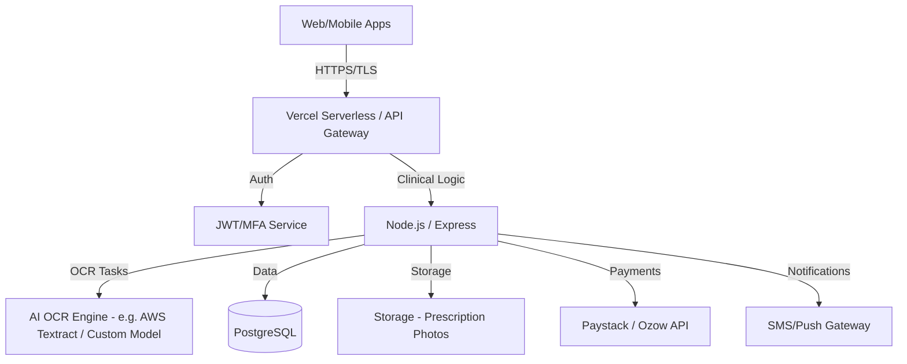

# 🏗️ PharmaLink | System Architecture & API Design

## 1. High-Level Architecture

## 2. Core API Modules

### 🔐 Authentication (`/api/auth`)
*   `POST /register`: Multi-persona registration (Patient, Doctor, Pharmacy, Driver).
*   `POST /login`: JWT issuance + MFA challenge if required.
*   `POST /verify-id`: SA ID number validation (integration with Home Affairs/3rd party).

### 📄 Clinical / Prescriptions (`/api/prescriptions`)
*   `POST /upload`: Patient submits physical script photo (Triggers OCR).
*   `POST /issue`: DOCTOR issues electronic prescription (Digital signature required).
*   `GET /validate/:id`: PHARMACIST reviews OCR vs Image and approves/rejects.
*   `GET /patient/history`: Fetches verified medical history.

### 💰 Logistics & Payments (`/api/orders`)
*   `POST /calculate-fee`: Distance-based logistics pricing (Google Maps Matrix).
*   `POST /initialize-payment`: Paystack/Ozow transaction link generation.
*   `GET /tracking/:id`: Real-time location + temperature status (IoT Relay).

### 🚚 Courier Terminal (`/api/deliveries`)
*   `GET /available-jobs`: Nearby delivery requests for drivers.
*   `PATCH /status`: Update status (Picked up, En Route, Arrived).
*   `POST /verify-biometric`: Finalize S5/S6 delivery via face/fingerprint.

## 3. Data Flow: The "Safe-Script" Path
1.  **Ingestion**: Patient uploads prescription `image.jpg`.
2.  **Processing**: Server stores image in S3 and sends a background task to AI OCR.
3.  **Verification**: Pharmacist sees the side-by-side view (Image vs Extracted Text) and confirms dosage/medication.
4.  **Transaction**: System calculates co-payment; patient pays via banking app deep-link.
5.  **Dispatch**: Logistics engine assigns local Courier; IoT bag tracking begins.
6.  **Handoff**: Courier arrives; Patient performs biometric unlock; Delivery closed.

---

## 4. MVP Tech Stack (PharmaLink Build)
*   **Infrastructure**: Vercel (Frontend + Serverless Backend).
*   **Database**: Supabase / PostgreSQL.
*   **Edge Logic**: Node.js.
*   **Client**: HTML5/Vanilla JS (MVP) -> React Native (Production).
*   **Real-time**: Socket.io for driver tracking.
